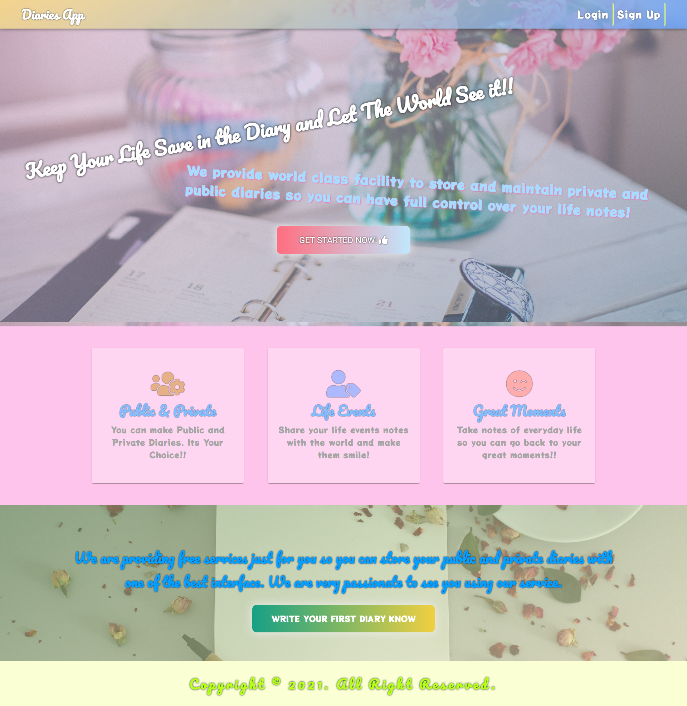
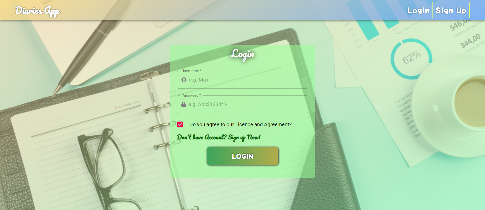
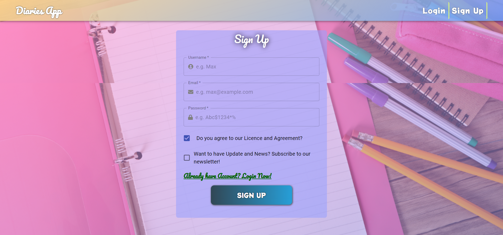
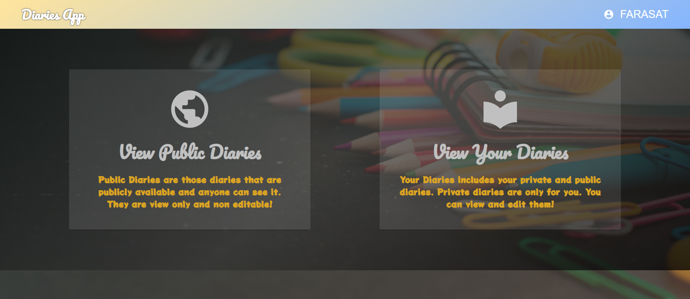

# 👨‍💻 React Diary App.
## 📽 A project based on Panacloud React Bootcamp [Project 9B].

### ⚒ Project Demo:
####  For Project Demo Follow the Link: https://diaries-app-react.netlify.app

### 🕵️‍♂️ Project Details:
####  This project is based on primarily on React TypeScript as well as uses other libraries too. In this app, you can use public and private diaries!

### ⚙ Technical Details:
#### In this project, React with TypeScript is used for the project. Other Libraries used includes Material-UI, TypeScript, FontAwesome, Cuid, ReduxJS-Toolkit, React-Redux, React-Router, MirageJS and React-Toastify.

### 🤹‍♂️ Skill:
&nbsp;&nbsp;&nbsp;&nbsp;
&nbsp;&nbsp;&nbsp;&nbsp;
&nbsp;&nbsp;&nbsp;&nbsp;
&nbsp;&nbsp;&nbsp;&nbsp;
&nbsp;&nbsp;&nbsp;&nbsp;
&nbsp;&nbsp;&nbsp;&nbsp;

### ✔ Contributers:

  <a href="https://github.com/faraasat">
    &nbsp&nbsp&nbsp&nbsp&nbsp&nbsp&nbsp&nbsp&nbsp&nbsp&nbsp&nbsp
  </a>

### 📷 Project UI:

  <a href="https://diaries-app-react.netlify.app">
    &nbsp&nbsp&nbsp&nbsp&nbsp&nbsp&nbsp&nbsp&nbsp&nbsp&nbsp&nbsp
  </a>

  <a href="https://diaries-app-react.netlify.app">
    &nbsp&nbsp&nbsp&nbsp&nbsp&nbsp&nbsp&nbsp&nbsp&nbsp&nbsp&nbsp
  </a>

  <a href="https://diaries-app-react.netlify.app">
    &nbsp&nbsp&nbsp&nbsp&nbsp&nbsp&nbsp&nbsp&nbsp&nbsp&nbsp&nbsp
  </a>

  <a href="https://diaries-app-react.netlify.app">
    &nbsp&nbsp&nbsp&nbsp&nbsp&nbsp&nbsp&nbsp&nbsp&nbsp&nbsp&nbsp
  </a>

